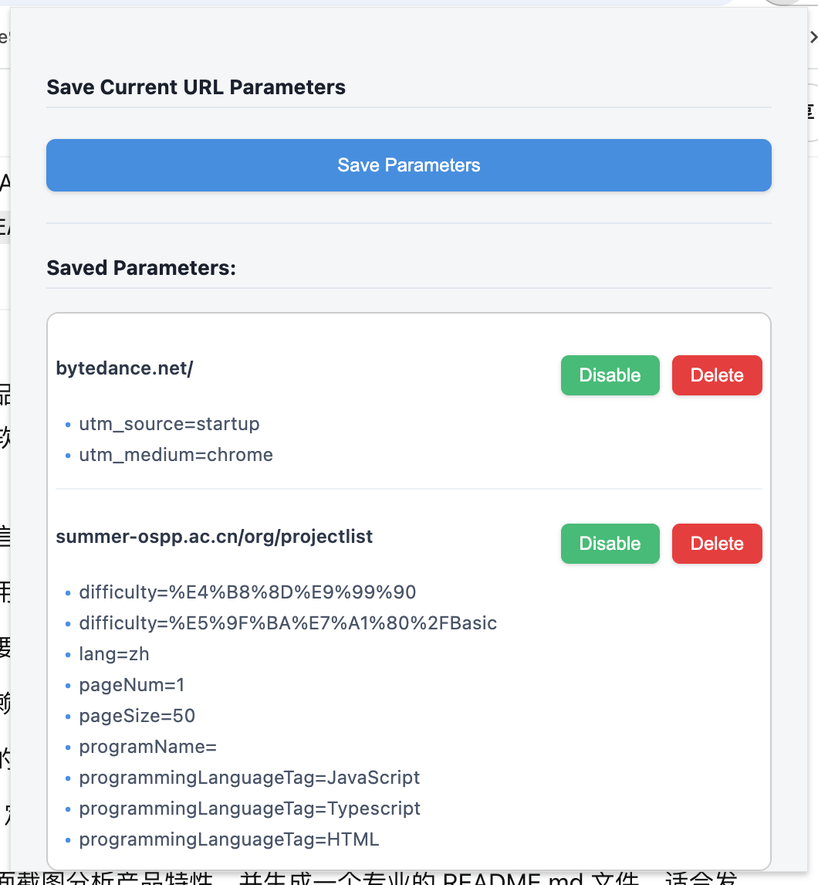

# URL 参数记录器

URL 参数记录器是一款浏览器插件，可以帮助您保存特定网站路径下的 URL 参数，并在您将来再次访问这些路径时自动应用这些参数。这对于需要频繁访问带有特定查询参数的页面的用户非常有用，例如在进行软件测试、数据分析或访问特定配置的在线服务时。

## ✨ 产品亮点

- **一键保存**：轻松保存当前页面的 URL 参数。
- **自动应用**：再次访问已保存的域名和路径时，自动附加保存的参数到 URL。
- **参数管理**：在插件弹窗中清晰列出已保存的参数，方便查看、启用/禁用或删除。
- **灵活控制**：可以为每个已保存的条目单独设置启用或禁用状态。
- **用户友好**：简洁直观的界面，易于上手。

## 📸 截图展示

以下是插件的主要界面和操作流程：

1.  **插件弹出窗口**：点击浏览器工具栏中的插件图标，会显示如下弹出窗口。您可以点击 "Save Parameters" 按钮来保存当前页面的 URL 参数。

      <!-- 请将此处的图片链接替换为您的实际截图链接 -->

2.  **已保存参数列表**：成功保存后，参数会显示在 "Saved Parameters" 列表中。每个条目会显示域名/路径，以及具体的参数键值对。

3.  **管理参数**：您可以对每个已保存的条目进行管理：
    *   **Disable/Enable**：临时禁用或重新启用某条规则，而无需删除它。
    *   **Delete**：永久删除某条规则。

## 🚀 功能概览

-   **参数保存**：
    -   自动提取当前激活标签页的 URL。
    -   以 `域名+路径` 作为唯一标识（Key）。
    -   保存 URL 中的查询参数 (`url.search`)。
    -   初始状态默认为“启用”。
-   **参数自动应用** (`content_script.js`)：
    -   当用户访问任何页面时，脚本会自动运行。
    -   提取当前页面的 `域名+路径`。
    -   在本地存储中查找是否有匹配的已保存且“启用”的参数规则。
    -   如果找到匹配规则，并且当前 URL 的参数与保存的参数不同，则自动跳转到带有已保存参数的新 URL。
    -   使用 `sessionStorage` 防止因参数应用导致的无限重定向循环。
-   **参数管理界面** (`popup.html` 和 `popup.js`)：
    -   显示所有已保存的参数规则列表。
    -   每个条目显示其关联的 `域名+路径` 和具体的参数。
    -   提供“启用 (Enable)”/“禁用 (Disable)”按钮来切换规则的生效状态。
    -   提供“删除 (Delete)”按钮来移除不再需要的规则。
    -   保存或删除操作后，列表会动态更新。

## 🛠️ 安装和使用说明

目前，该插件需要手动加载到浏览器中（以 Chrome 浏览器为例）：

1.  **下载代码**：将本项目代码下载到您的本地计算机。
2.  **打开扩展程序页面**：
    *   在 Chrome 浏览器地址栏输入 `chrome://extensions` 并回车。
    *   或者，点击浏览器右上角的三个点（菜单） -> 更多工具 -> 扩展程序。
3.  **启用开发者模式**：在扩展程序页面的右上角，打开“开发者模式”开关。
4.  **加载已解压的扩展程序**：
    *   点击“加载已解压的扩展程序”按钮。
    *   在弹出的文件选择对话框中，选择您在步骤1中下载并解压的项目文件夹 (包含 `manifest.json` 文件的那个文件夹)。
5.  **完成安装**：插件图标应该会出现在浏览器的工具栏中。

**使用方法**：

1.  当您访问一个带有希望保存的 URL 参数的网页时，点击浏览器工具栏上的“URL Params Recorder”插件图标。
2.  在弹出的窗口中，点击“Save Parameters”按钮。
3.  该 URL 的域名、路径以及参数将被保存。
4.  之后，当您再次访问该域名下的相同路径时，插件会自动将之前保存的参数附加到 URL 并重新加载页面。
5.  您可以随时点击插件图标，查看、禁用/启用或删除已保存的参数规则。

## 💻 技术栈

-   **核心技术**：HTML, CSS, JavaScript (ES6+)
-   **浏览器 API**：
    -   `chrome.storage.local`：用于在用户本地持久化存储已保存的 URL 参数及其状态。
    -   `chrome.tabs.query`：用于获取当前激活标签页的信息（如 URL）。
    -   `chrome.scripting`：(虽然在 `manifest.json` 中声明了，但主要通过 `content_scripts` 实现功能注入，如果未来有动态注入脚本的需求则会用到)。
    -   `URL API`：用于解析和操作 URL。
    -   `sessionStorage`：用于防止内容脚本在应用参数时发生无限重定向。
-   **清单文件**：`manifest.json` (Version 3)
    -   定义了插件的名称、版本、描述、权限、图标、弹出页面 (`popup.html`) 和内容脚本 (`content_script.js`)。

## 📄 开源许可

---

希望这款插件能为您带来便利！如果您有任何建议或发现任何问题，欢迎提出 Issue。